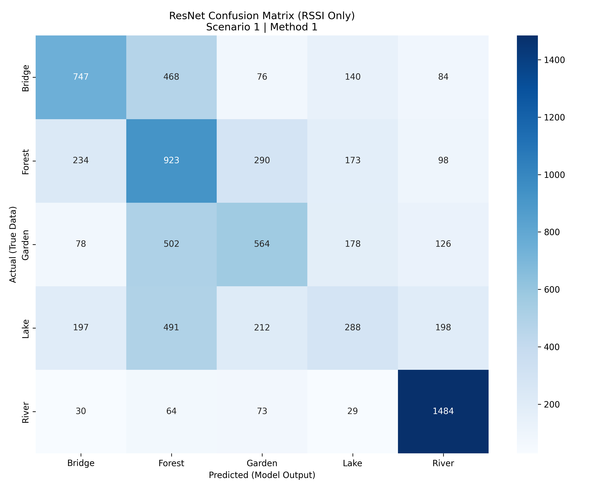
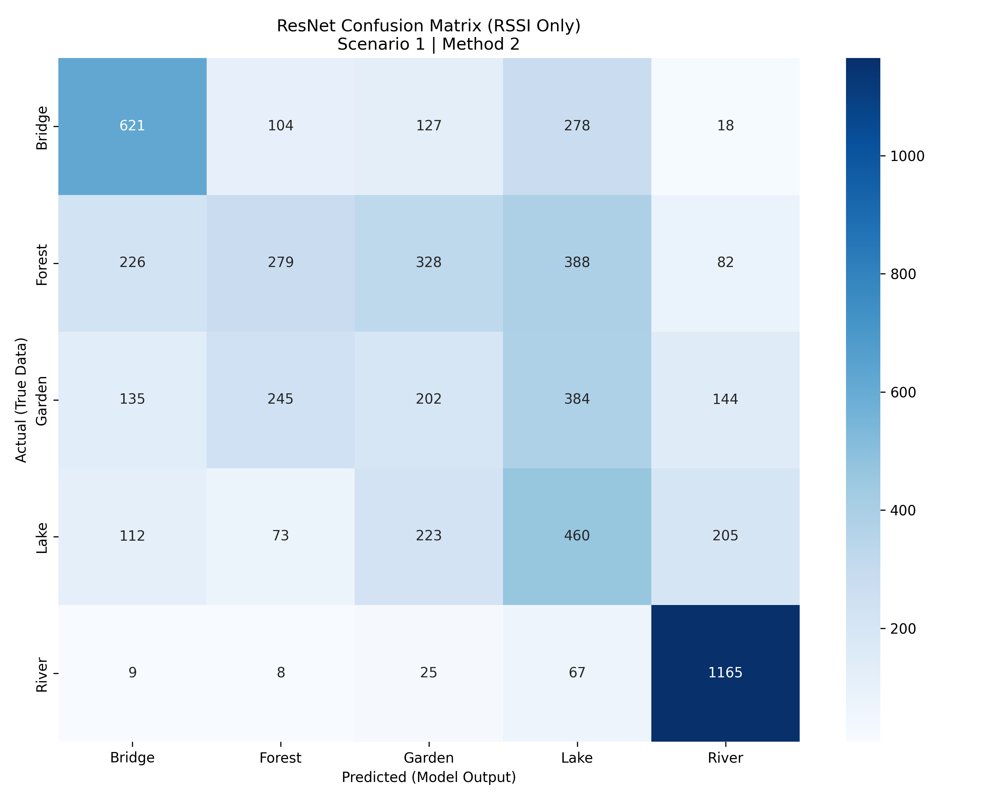
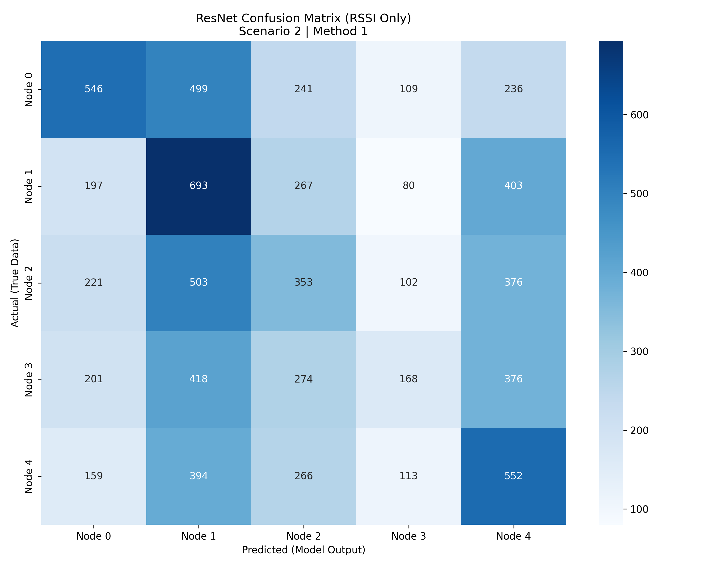

# ResNet Model: Final Evaluation Results

This document presents the performance metrics for the 1D ResNet architecture. All experiments were conducted using the same dataset as the CNN models to ensure a controlled comparison.

---

## Scenario 1: Environment Prediction
**Objective:** Categorize the signal location into one of five environments: Bridge, Forest, Garden, Lake, and River.

### Method 1: Random Split
* **Overall Accuracy:** 51.71%
* **Weighted Average F1-Score:** 50.41%

| Class | Precision | Recall | F1-Score | Support |
| :--- | :--- | :--- | :--- | :--- |
| **Bridge** | 0.58 | 0.49 | 0.53 | 1515 |
| **Forest** | 0.38 | 0.54 | 0.44 | 1718 |
| **Garden** | 0.46 | 0.39 | 0.42 | 1448 |
| **Lake** | 0.36 | 0.21 | 0.26 | 1386 |
| **River** | 0.75 | 0.88 | 0.81 | 1680 |

**Visual Analysis:**

### Method 2: Leave-One-Out (Generalization to New Nodes)
* **Overall Accuracy:** 46.16%
* **Weighted Average F1-Score:** 44.31%

| Class | Precision | Recall | F1-Score | Support |
| :--- | :--- | :--- | :--- | :--- |
| **Bridge** | 0.56 | 0.54 | 0.55 | 1148 |
| **Forest** | 0.39 | 0.21 | 0.28 | 1303 |
| **Garden** | 0.22 | 0.18 | 0.20 | 1110 |
| **Lake** | 0.29 | 0.43 | 0.35 | 1073 |
| **River** | 0.72 | 0.91 | 0.81 | 1274 |

**Visual Analysis:**

---

## Scenario 2: Node Identification
**Objective:** Identify the specific transmitter (Sender ID) of the packet.

### Method 1: Random Split
* **Overall Accuracy:** 29.84%
* **Weighted Average F1-Score:** 28.92%

| Class | Precision | Recall | F1-Score | Support |
| :--- | :--- | :--- | :--- | :--- |
| **Node 0** | 0.41 | 0.33 | 0.37 | 1631 |
| **Node 1** | 0.28 | 0.42 | 0.33 | 1640 |
| **Node 2** | 0.25 | 0.23 | 0.24 | 1555 |
| **Node 3** | 0.29 | 0.12 | 0.17 | 1437 |
| **Node 4** | 0.28 | 0.37 | 0.32 | 1484 |

**Visual Analysis:**

---

## Technical Comparison: CNN vs. ResNet

A comparative analysis between the CNN and ResNet architectures yields the following observations:

1.  **Baseline Performance (Scenario 1, Method 1):** The CNN architecture demonstrates high performance in the initial random split environment classification. While ResNet shows high recall in specific classes like the River environment, the CNN maintains a higher weighted average F1-score across all categories for this method.
2.  **Architecture Specifics:** The ResNet architecture utilizes residual blocks to mitigate the vanishing gradient problem, which is beneficial for identifying specific signal patterns in certain environments. However, the CNN remains highly effective for general classification tasks across the broader dataset.
3.  **Generalization (Scenario 1, Method 2):** ResNet demonstrates stability when tested on unseen nodes, maintaining a Weighted Average F1-score of 44.31%. This indicates the architecture's ability to learn environmental features that generalize across different hardware deployments.
4.  **Temporal Features:** Experimental results for the ResNet + Timestep configuration showed a decrease in performance. Consequently, the primary evaluation focuses on signal-based features to ensure the models are classifying based on environmental characteristics rather than packet timing.