# CNN

## Scenario 1

### Method 1

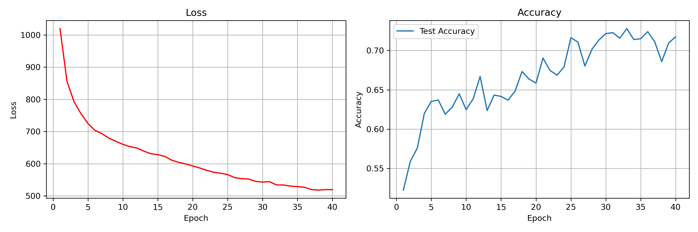
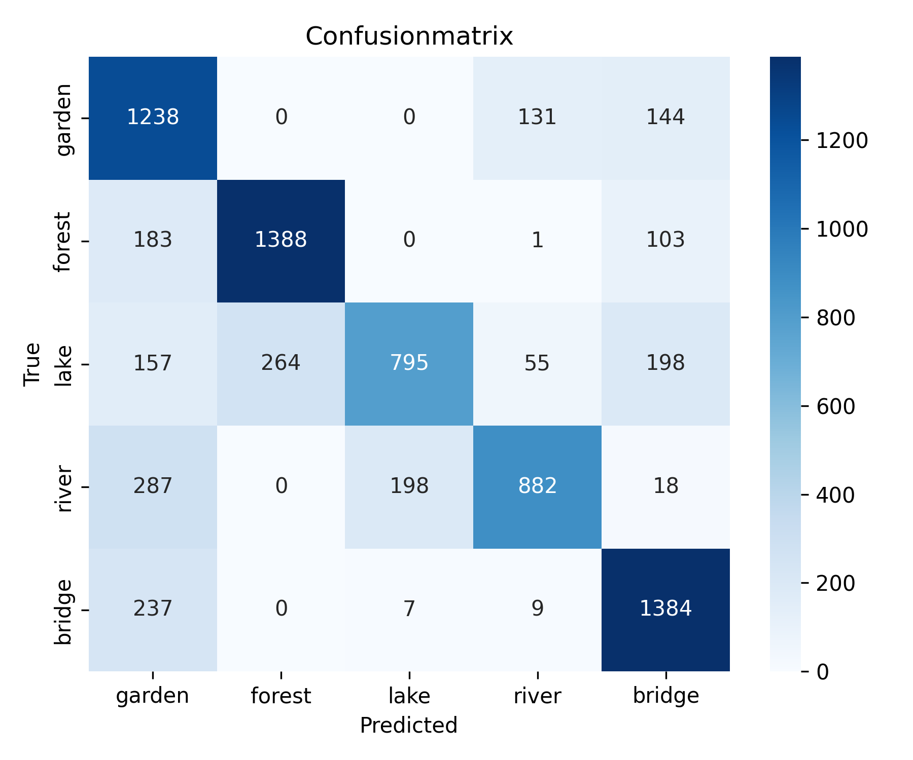

|              | precision |   recall |  f1-score |  support |
| ------------ | --------- | -------- | --------- | -------- |
|       garden |     0.59  |     0.82 |     0.68  |     1513 |
|       forest |     0.84  |     0.83 |     0.83  |     1675 |
|         lake |     0.80  |     0.54 |     0.64  |     1469 |
|        river |     0.82  |     0.64 |     0.72  |     1385 |
|       bridge |     0.75  |     0.85 |     0.79  |     1637 |
|              |           |          |           |          |
|     accuracy |           |          |     0.74  |     7679 |
|    macro avg |     0.76  |     0.73 |     0.73  |     7679 |
| weighted avg |     0.76  |     0.74 |     0.74  |     7679 |

### Method 2

#### Testing with id 0

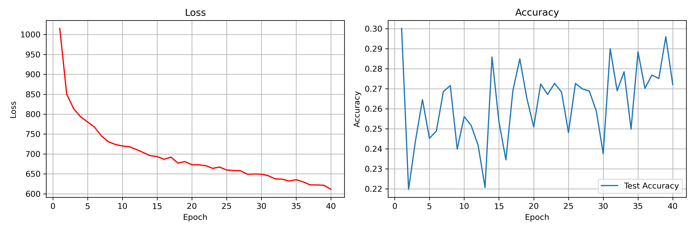
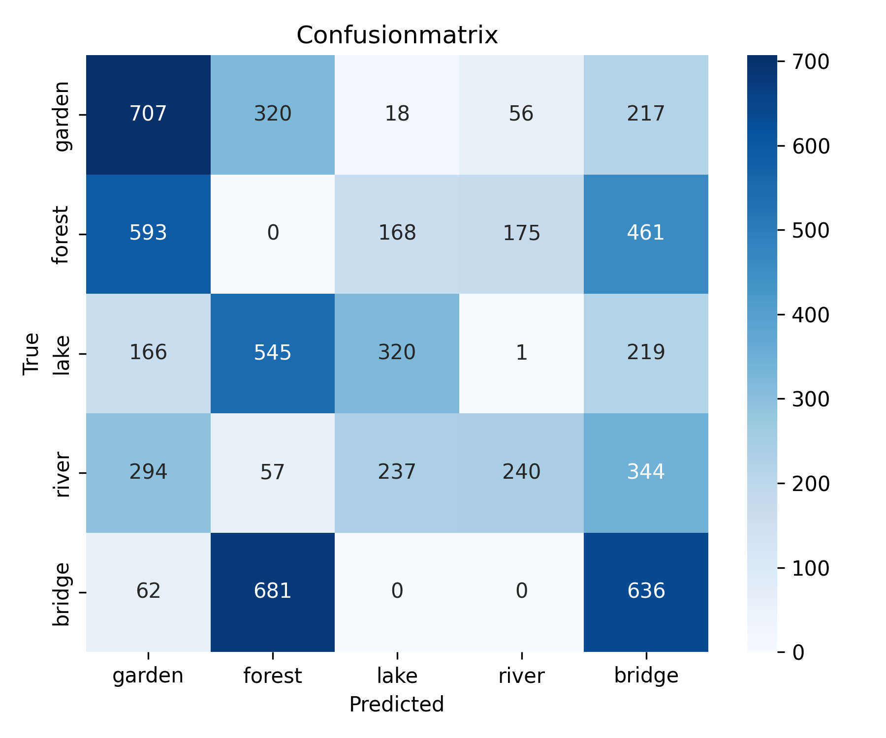

|              | precision |   recall |  f1-score |  support |
| ------------ | --------- | -------- | --------- | -------- |
|       garden |     0.39  |     0.54 |     0.45  |     1318 |
|       forest |     0.00  |     0.00 |     0.00  |     1397 |
|         lake |     0.43  |     0.26 |     0.32  |     1251 |
|        river |     0.51  |     0.20 |     0.29  |     1172 |
|       bridge |     0.34  |     0.46 |     0.39  |     1379 |
|              |           |          |           |          |
|     accuracy |           |          |     0.29  |     6517 |
|    macro avg |     0.33  |     0.29 |     0.29  |     6517 |
| weighted avg |     0.32  |     0.29 |     0.29  |     6517 |

#### Testing with id 1

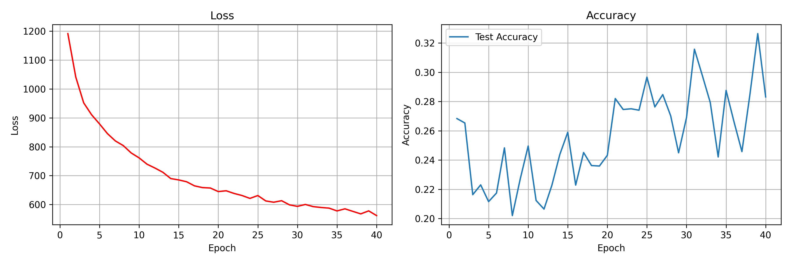
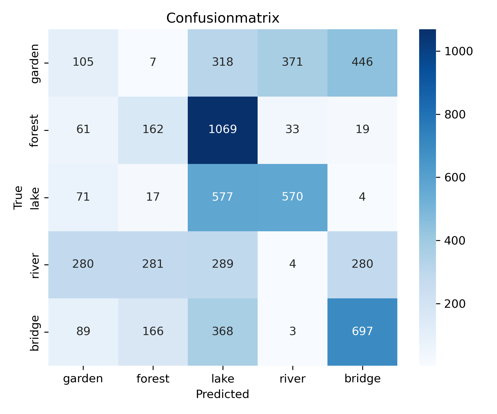

|              | precision |   recall |  f1-score |  support |
| ------------ | --------- | -------- | --------- | -------- |
|       garden |     0.19  |     0.06 |     0.09  |     1247 |
|       forest |     0.36  |     0.28 |     0.32  |     1344 |
|         lake |     0.25  |     0.50 |     0.33  |     1239 |
|        river |     0.04  |     0.03 |     0.03  |     1134 |
|       bridge |     0.45  |     0.51 |     0.48  |     1323 |
|              |           |          |           |          |
|     accuracy |           |          |     0.28  |     6287 |
|    macro avg |     0.26  |     0.28 |     0.25  |     6287 |
| weighted avg |     0.27  |     0.28 |     0.26  |     6287 |

#### Testing with id 2

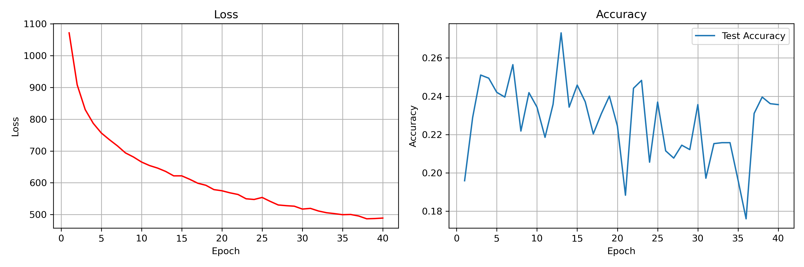
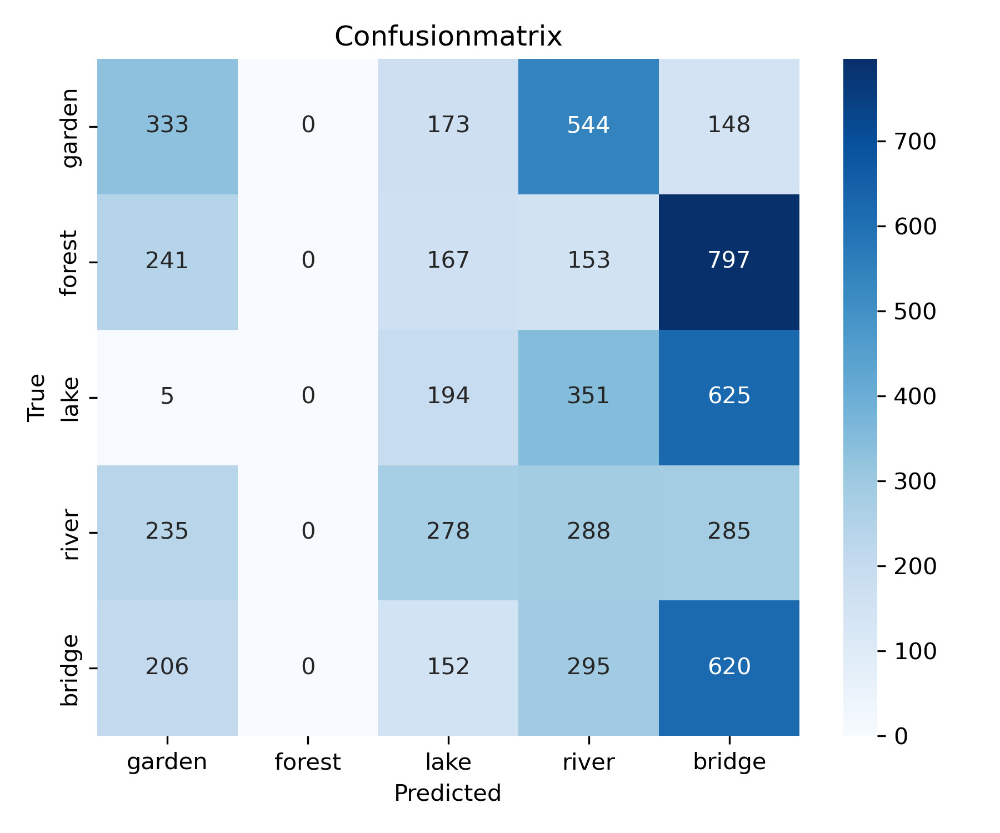

|              | precision |   recall |  f1-score |  support |
| ------------ | --------- | -------- | --------- | -------- |
|       garden |     0.23  |     0.25 |     0.24  |     1198 |
|       forest |     0.00  |     0.00 |     0.00  |     1358 |
|         lake |     0.19  |     0.07 |     0.10  |     1175 |
|        river |     0.18  |     0.26 |     0.21  |     1086 |
|       bridge |     0.23  |     0.51 |     0.31  |     1273 |
|              |           |          |           |          |
|     accuracy |           |          |     0.21  |     6090 |
|    macro avg |     0.17  |     0.22 |     0.17  |     6090 |
| weighted avg |     0.16  |     0.21 |     0.17  |     6090 |

#### Testing with id 3

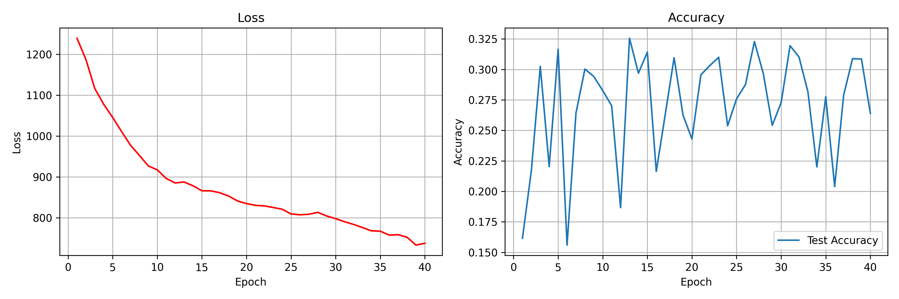
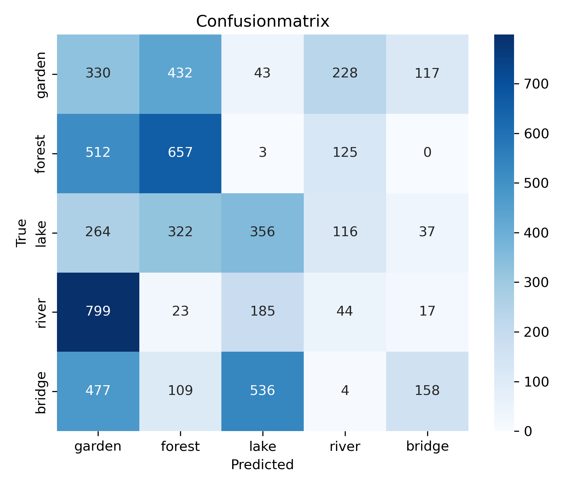

|              | precision |   recall |  f1-score |  support |
| ------------ | --------- | -------- | --------- | -------- |
|       garden |     0.10  |     0.18 |     0.13  |     1150 |
|       forest |     0.40  |     0.44 |     0.42  |     1297 |
|         lake |     0.32  |     0.29 |     0.30  |     1095 |
|        river |     0.16  |     0.10 |     0.12  |     1068 |
|       bridge |     0.50  |     0.27 |     0.35  |     1284 |
|              |           |          |           |          |
|     accuracy |           |          |     0.26  |     5894 |
|    macro avg |     0.29  |     0.26 |     0.27  |     5894 |
| weighted avg |     0.30  |     0.26 |     0.27  |     5894 |

#### Testing with id 4

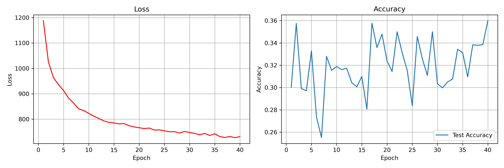
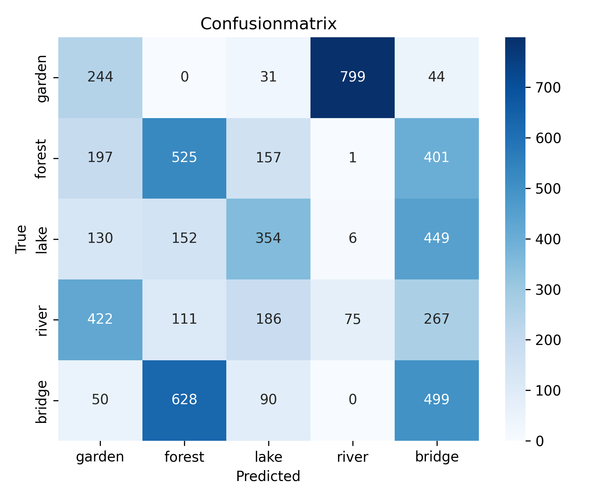

|              | precision |   recall |  f1-score |  support |
| ------------ | --------- | -------- | --------- | -------- |
|       garden |     0.23  |     0.22 |     0.23  |     1118 |
|       forest |     0.37  |     0.41 |     0.39  |     1281 |
|         lake |     0.43  |     0.32 |     0.37  |     1091 |
|        river |     0.09  |     0.07 |     0.08  |     1061 |
|       bridge |     0.30  |     0.39 |     0.34  |     1267 |
|              |           |          |           |          |
|     accuracy |           |          |     0.29  |     5818 |
|    macro avg |     0.28  |     0.28 |     0.28  |     5818 |
| weighted avg |     0.29  |     0.29 |     0.29  |     5818 |

## Scenario 2

### Method 1

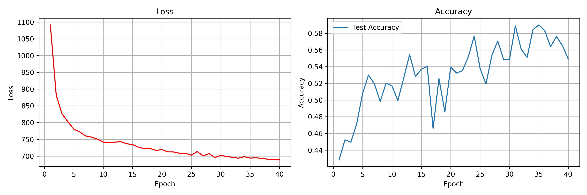
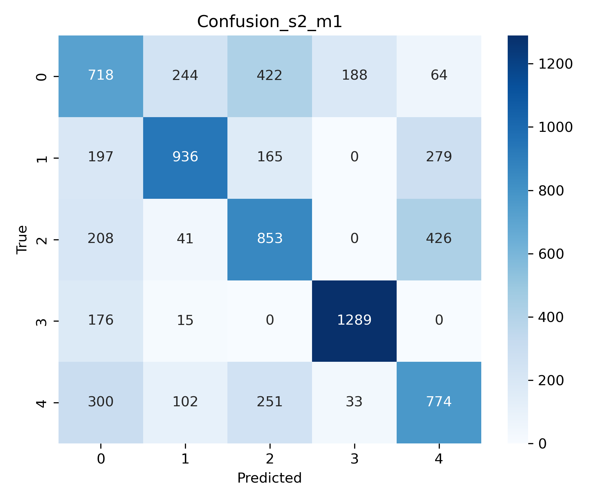

|              | precision |   recall |  f1-score |  support |
| ------------ | --------- | -------- | --------- | -------- |
|       node 0 |     0.40  |     0.38 |     0.39  |     1636 |
|       node 1 |     0.62  |     0.41 |     0.50  |     1577 |
|       node 2 |     0.49  |     0.60 |     0.54  |     1528 |
|       node 3 |     0.71  |     0.96 |     0.82  |     1480 |
|       node 4 |     0.49  |     0.42 |     0.45  |     1460 |
|              |           |          |           |          |
|     accuracy |           |          |     0.55  |     7681 |
|    macro avg |     0.54  |     0.55 |     0.54  |     7681 |
| weighted avg |     0.54  |     0.55 |     0.54  |     7681 |

### Method 2

#### Testing with id 0

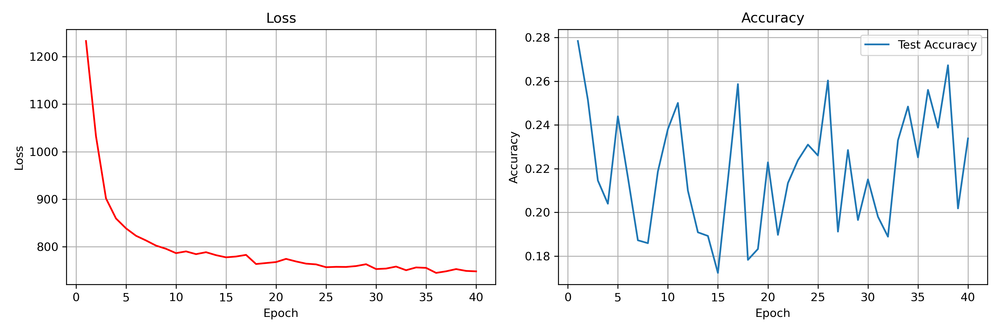
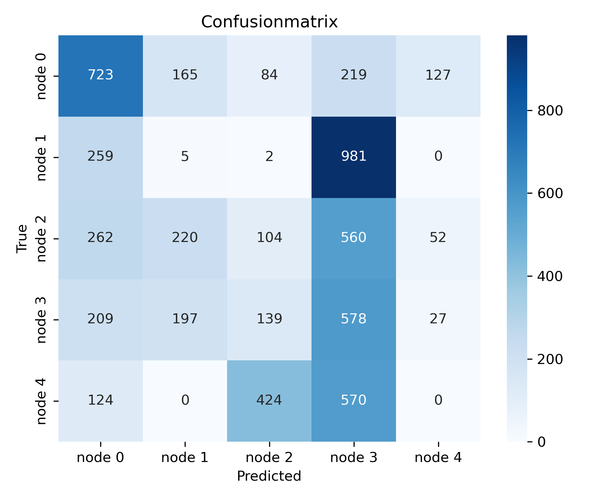

|              | precision |   recall |  f1-score |  support |
| ------------ | --------- | -------- | --------- | -------- |
|       node 0 |     0.48  |     0.57 |     0.52  |     1318 |
|       node 1 |     0.02  |     0.02 |     0.02  |     1247 |
|       node 2 |     0.18  |     0.09 |     0.12  |     1198 |
|       node 3 |     0.20  |     0.51 |     0.29  |     1150 |
|       node 4 |     0.00  |     0.00 |     0.00  |     1118 |
|              |           |          |           |          |
|     accuracy |           |          |     0.24  |     6031 |
|    macro avg |     0.18  |     0.24 |     0.19  |     6031 |
| weighted avg |     0.18  |     0.24 |     0.20  |     6031 |

#### Testing with id 1

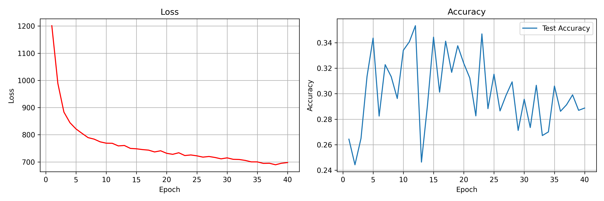
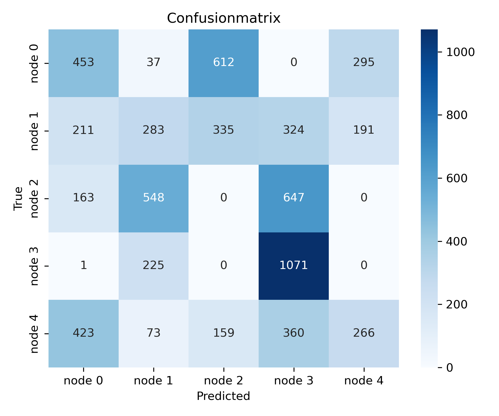

|              | precision |   recall |  f1-score |  support |
| ------------ | --------- | -------- | --------- | -------- |
|       node 0 |     0.49  |     0.26 |     0.34  |     1397 |
|       node 1 |     0.23  |     0.25 |     0.24  |     1344 |
|       node 2 |     0.00  |     0.00 |     0.00  |     1358 |
|       node 3 |     0.45  |     0.79 |     0.57  |     1297 |
|       node 4 |     0.34  |     0.16 |     0.22  |     1281 |
|              |           |          |           |          |
|     accuracy |           |          |     0.29  |     6677 |
|    macro avg |     0.30  |     0.29 |     0.27  |     6677 |
| weighted avg |     0.30  |     0.29 |     0.27  |     6677 |

#### Testing with id 2

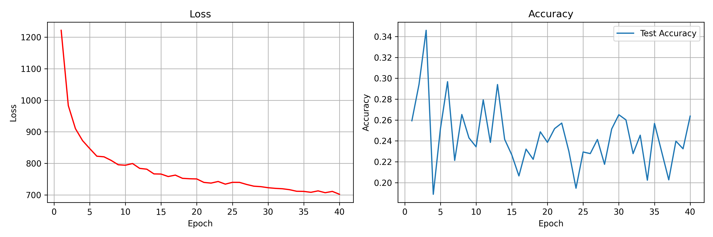
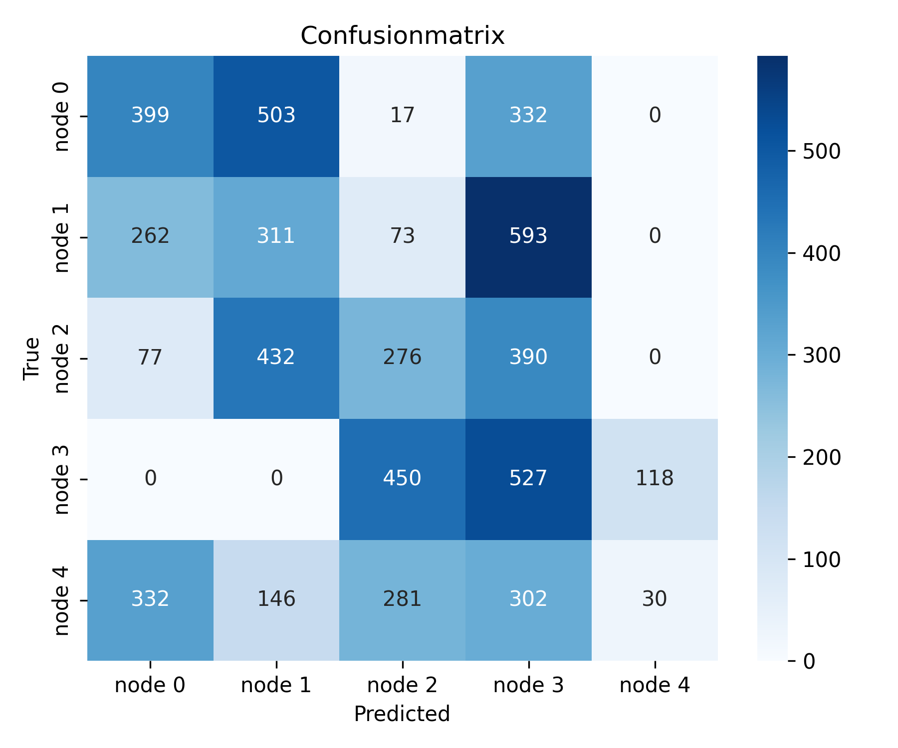

|              | precision |   recall |  f1-score |  support |
| ------------ | --------- | -------- | --------- | -------- |
|       node 0 |     0.37  |     0.32 |     0.34  |     1251 |
|       node 1 |     0.22  |     0.25 |     0.24  |     1239 |
|       node 2 |     0.25  |     0.23 |     0.24  |     1175 |
|       node 3 |     0.25  |     0.48 |     0.33  |     1095 |
|       node 4 |     0.20  |     0.03 |     0.05  |     1091 |
|              |           |          |           |          |
|     accuracy |           |          |     0.26  |     5851 |
|    macro avg |     0.26  |     0.26 |     0.24  |     5851 |
| weighted avg |     0.26  |     0.26 |     0.24  |     5851 |

#### Testing with id 3

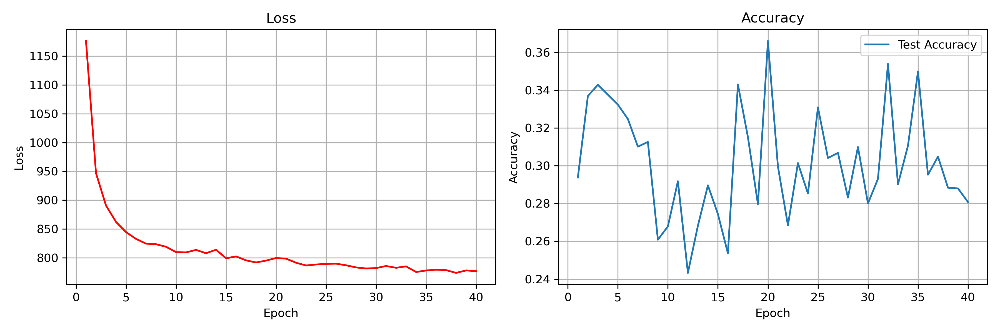
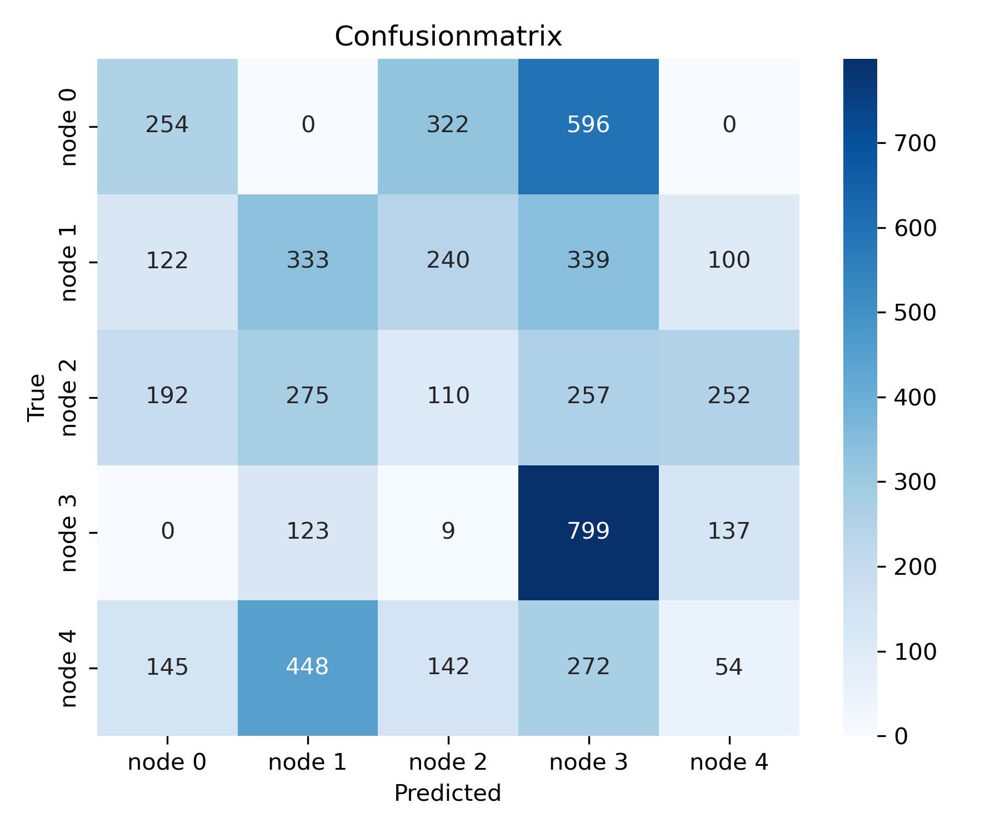

|              | precision |   recall |  f1-score |  support |
| ------------ | --------- | -------- | --------- | -------- |
|       node 0 |     0.39  |     0.32 |     0.35  |     1172 |
|       node 1 |     0.23  |     0.23 |     0.23  |     1134 |
|       node 2 |     0.23  |     0.18 |     0.20  |     1086 |
|       node 3 |     0.33  |     0.75 |     0.45  |     1068 |
|       node 4 |     0.02  |     0.00 |     0.00  |     1061 |
|              |           |          |           |          |
|     accuracy |           |          |     0.30  |     5521 |
|    macro avg |     0.24  |     0.30 |     0.25  |     5521 |
| weighted avg |     0.24  |     0.30 |     0.25  |     5521 |

#### Testing with id 4

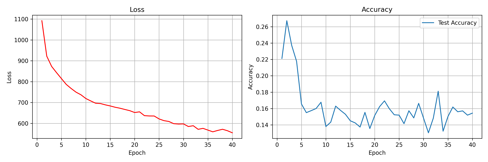
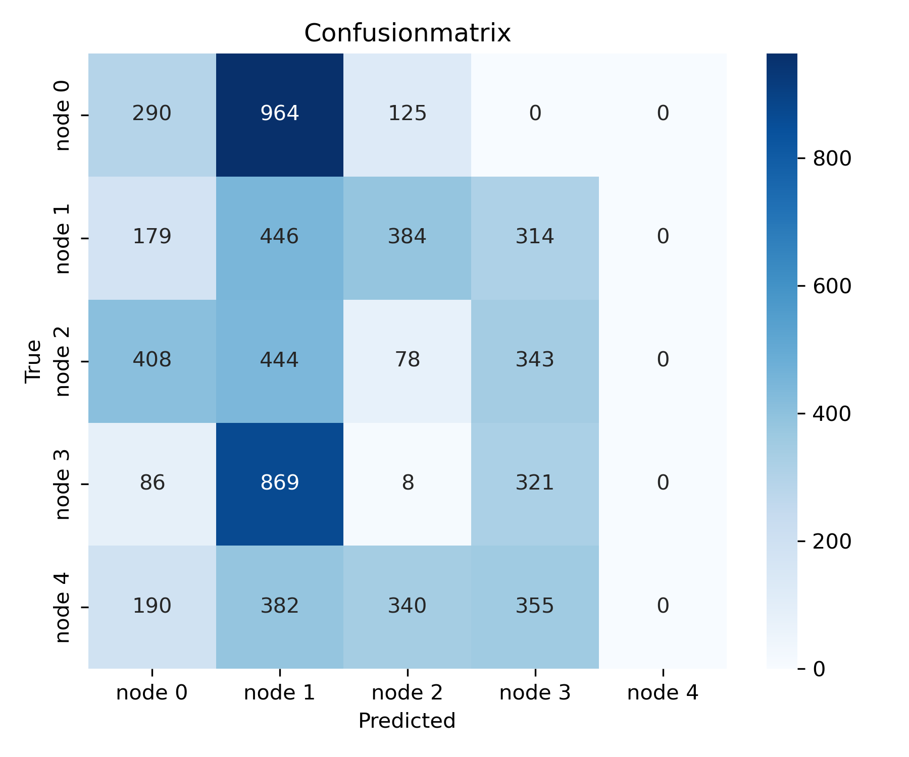

|              | precision |   recall |  f1-score |  support |
| ------------ | --------- | -------- | --------- | -------- |
|       node 0 |     0.22  |     0.11 |     0.15  |     1379 |
|       node 1 |     0.14  |     0.35 |     0.20  |     1323 |
|       node 2 |     0.07  |     0.06 |     0.06  |     1273 |
|       node 3 |     0.22  |     0.25 |     0.23  |     1284 |
|       node 4 |     0.00  |     0.00 |     0.00  |     1267 |
|              |           |          |           |          |
|     accuracy |           |          |     0.15  |     6526 |
|    macro avg |     0.13  |     0.15 |     0.13  |     6526 |
| weighted avg |     0.13  |     0.15 |     0.13  |     6526 |

# ResNet

## Scenario 1

### Method 1

|              | precision |   recall |  f1-score |  support |
| ------------ | --------- | -------- | --------- | -------- |
|       garden |     0.66  |     0.77 |     0.71  |     1513 |
|       forest |     0.76  |     0.87 |     0.81  |     1675 |
|         lake |     0.75  |     0.60 |     0.67  |     1469 |
|        river |     0.81  |     0.57 |     0.67  |     1385 |
|       bridge |     0.79  |     0.89 |     0.84  |     1637 |
|              |           |          |           |          |
|     accuracy |           |          |     0.75  |     7679 |
|    macro avg |     0.75  |     0.74 |     0.74  |     7679 |
| weighted avg |     0.75  |     0.75 |     0.74  |     7679 |

### Method 2

#### Testing with id 0

|              | precision |   recall |  f1-score |  support |
| ------------ | --------- | -------- | --------- | -------- |
|       garden |     0.43  |     0.41 |     0.42  |     1318 |
|       forest |     0.00  |     0.00 |     0.00  |     1397 |
|         lake |     0.15  |     0.09 |     0.11  |     1251 |
|        river |     0.17  |     0.16 |     0.17  |     1172 |
|       bridge |     0.32  |     0.46 |     0.37  |     1379 |
|              |           |          |           |          |
|     accuracy |           |          |     0.22  |     6517 |
|    macro avg |     0.21  |     0.22 |     0.21  |     6517 |
| weighted avg |     0.21  |     0.22 |     0.21  |     6517 |

#### Testing with id 1

|              | precision |   recall |  f1-score |  support |
| ------------ | --------- | -------- | --------- | -------- |
|       garden |     0.20  |     0.20 |     0.20  |     1247 |
|       forest |     0.35  |     0.28 |     0.31  |     1344 |
|         lake |     0.22  |     0.21 |     0.21  |     1239 |
|        river |     0.13  |     0.13 |     0.13  |     1134 |
|       bridge |     0.57  |     0.73 |     0.64  |     1323 |
|              |           |          |           |          |
|     accuracy |           |          |     0.32  |     6287 |
|    macro avg |     0.29  |     0.31 |     0.30  |     6287 |
| weighted avg |     0.30  |     0.32 |     0.31  |     6287 |

#### Testing with id 2

|              | precision |   recall |  f1-score |  support |
| ------------ | --------- | -------- | --------- | -------- |
|       garden |     0.39  |     0.46 |     0.42  |     1198 |
|       forest |     0.01  |     0.00 |     0.00  |     1358 |
|         lake |     0.30  |     0.19 |     0.23  |     1175 |
|        river |     0.22  |     0.26 |     0.24  |     1086 |
|       bridge |     0.25  |     0.51 |     0.34  |     1273 |
|              |           |          |           |          |
|     accuracy |           |          |     0.28  |     6090 |
|    macro avg |     0.23  |     0.28 |     0.25  |     6090 |
| weighted avg |     0.23  |     0.28 |     0.24  |     6090 |

#### Testing with id 3

|              | precision |   recall |  f1-score |  support |
| ------------ | --------- | -------- | --------- | -------- |
|       garden |     0.14  |     0.29 |     0.19  |     1150 |
|       forest |     0.45  |     0.50 |     0.47  |     1297 |
|         lake |     0.32  |     0.24 |     0.27  |     1095 |
|        river |     0.21  |     0.15 |     0.17  |     1068 |
|       bridge |     0.82  |     0.31 |     0.45  |     1284 |
|              |           |          |           |          |
|     accuracy |           |          |     0.30  |     5894 |
|    macro avg |     0.39  |     0.30 |     0.31  |     5894 |
| weighted avg |     0.40  |     0.30 |     0.32  |     5894 |

#### Testing with id 4

|              | precision |   recall |  f1-score |  support |
| ------------ | --------- | -------- | --------- | -------- |
|       garden |     0.25  |     0.19 |     0.21  |     1118 |
|       forest |     0.52  |     0.49 |     0.51  |     1281 |
|         lake |     0.30  |     0.38 |     0.33  |     1091 |
|        river |     0.15  |     0.14 |     0.14  |     1061 |
|       bridge |     0.43  |     0.46 |     0.45  |     1267 |
|              |           |          |           |          |
|     accuracy |           |          |     0.34  |     5818 |
|    macro avg |     0.33  |     0.33 |     0.33  |     5818 |
| weighted avg |     0.34  |     0.34 |     0.34  |     5818 |

## Scenario 2

### Method 1

|              | precision |   recall |  f1-score |  support |
| ------------ | --------- | -------- | --------- | -------- |
|       node 0 |     0.50  |     0.69 |     0.58  |     1636 |
|       node 1 |     0.71  |     0.70 |     0.71  |     1577 |
|       node 2 |     0.69  |     0.39 |     0.50  |     1528 |
|       node 3 |     0.84  |     0.89 |     0.86  |     1480 |
|       node 4 |     0.58  |     0.57 |     0.58  |     1460 |
|              |           |          |           |          |
|     accuracy |           |          |     0.65  |     7681 |
|    macro avg |     0.67  |     0.65 |     0.65  |     7681 |
| weighted avg |     0.66  |     0.65 |     0.64  |     7681 |

### Method 2

#### Testing with id 0

|              | precision |   recall |  f1-score |  support |
| ------------ | --------- | -------- | --------- | -------- |
|       node 0 |     0.52  |     0.41 |     0.46  |     1318 |
|       node 1 |     0.01  |     0.01 |     0.01  |     1247 |
|       node 2 |     0.27  |     0.35 |     0.31  |     1198 |
|       node 3 |     0.19  |     0.38 |     0.25  |     1150 |
|       node 4 |     0.00  |     0.00 |     0.00  |     1118 |
|              |           |          |           |          |
|     accuracy |           |          |     0.23  |     6031 |
|    macro avg |     0.20  |     0.23 |     0.21  |     6031 |
| weighted avg |     0.21  |     0.23 |     0.21  |     6031 |

#### Testing with id 1

|              | precision |   recall |  f1-score |  support |
| ------------ | --------- | -------- | --------- | -------- |
|       node 0 |     0.42  |     0.31 |     0.35  |     1397 |
|       node 1 |     0.22  |     0.25 |     0.23  |     1344 |
|       node 2 |     0.00  |     0.00 |     0.00  |     1358 |
|       node 3 |     0.47  |     0.81 |     0.59  |     1297 |
|       node 4 |     0.40  |     0.07 |     0.13  |     1281 |
|              |           |          |           |          |
|     accuracy |           |          |     0.29  |     6677 |
|    macro avg |     0.30  |     0.29 |     0.26  |     6677 |
| weighted avg |     0.30  |     0.29 |     0.26  |     6677 |

#### Testing with id 2

|              | precision |   recall |  f1-score |  support |
| ------------ | --------- | -------- | --------- | -------- |
|       node 0 |     0.43  |     0.23 |     0.30  |     1251 |
|       node 1 |     0.22  |     0.24 |     0.23  |     1239 |
|       node 2 |     0.18  |     0.23 |     0.20  |     1175 |
|       node 3 |     0.25  |     0.48 |     0.33  |     1095 |
|       node 4 |     0.26  |     0.04 |     0.07  |     1091 |
|              |           |          |           |          |
|     accuracy |           |          |     0.24  |     5851 |
|    macro avg |     0.27  |     0.24 |     0.22  |     5851 |
| weighted avg |     0.27  |     0.24 |     0.23  |     5851 |

#### Testing with id 3

|              | precision |   recall |  f1-score |  support |
| ------------ | --------- | -------- | --------- | -------- |
|       node 0 |     0.29  |     0.25 |     0.27  |     1172 |
|       node 1 |     0.22  |     0.19 |     0.20  |     1134 |
|       node 2 |     0.21  |     0.18 |     0.19  |     1086 |
|       node 3 |     0.35  |     0.75 |     0.48  |     1068 |
|       node 4 |     0.19  |     0.05 |     0.07  |     1061 |
|              |           |          |           |          |
|     accuracy |           |          |     0.28  |     5521 |
|    macro avg |     0.25  |     0.28 |     0.24  |     5521 |
| weighted avg |     0.25  |     0.28 |     0.24  |     5521 |

#### Testing with id 4

|              | precision |   recall |  f1-score |  support |
| ------------ | --------- | -------- | --------- | -------- |
|       node 0 |     0.29  |     0.25 |     0.27  |     1379 |
|       node 1 |     0.12  |     0.22 |     0.15  |     1323 |
|       node 2 |     0.14  |     0.18 |     0.16  |     1273 |
|       node 3 |     0.26  |     0.25 |     0.26  |     1284 |
|       node 4 |     0.00  |     0.00 |     0.00  |     1267 |
|              |           |          |           |          |
|     accuracy |           |          |     0.18  |     6526 |
|    macro avg |     0.16  |     0.18 |     0.17  |     6526 |
| weighted avg |     0.16  |     0.18 |     0.17  |     6526 |

